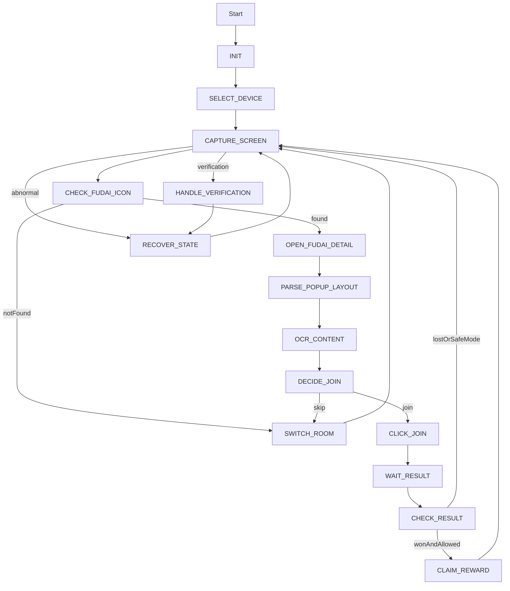

# 仓库根目录 MVP 架构计划

## 目标
基于现有规格文档 [D:/develop/cursor2026/Immortality/doc/AI生成简版Prompt.md](D:/develop/cursor2026/Immortality/doc/AI生成简版Prompt.md)，在仓库根目录直接搭建可运行的 Go 1.22+ 执行端 MVP，不先做完整管理系统，但会保留后续接入远程配置、记录上报和 Web 管理端的接口边界。若后续增加前端页面，默认采用 `layui`。

## 第一阶段交付
- 根目录初始化 Go 项目：`go.mod`、`README.md`、`config.yaml`。
- 建立可扩展目录：`cmd/douyin-bot/`、`internal/app/`、`internal/device/`、`internal/capture/`、`internal/ocr/`、`internal/detectors/`、`internal/actions/`、`internal/strategy/`、`internal/repository/`、`internal/integration/`、`internal/utils/`。
- 实现可运行主链路：设备选择 -> 截图 -> 页面检测 -> 福袋入口识别 -> 弹窗解析 -> 策略判断 -> 点击参与 -> 等待开奖 -> 结果识别 -> 恢复/切房。
- 先提供本地版配置与记录存储，但接口设计兼容后续 HTTP API / gRPC / DB 持久化。

## 架构原则
- 以“执行端”优先，不在 MVP 中引入完整前端或后台管理系统。
- 以领域模型驱动：`Device`、`LiveRoom`、`LotteryTask`、`LotteryRecord`、`RuntimeConfig`、`StrategyConfig`。
- 检测、动作、策略、存储解耦，避免把 ADB/OCR/业务判断糅在一起。
- 所有关键输出使用结构化日志与结构化记录，便于后续直接接管理端。
- 默认 `safe_mode=true`，领奖识别可做，自动下单默认关闭。

## 建议目录落地
- `cmd/douyin-bot/main.go`：程序入口、依赖装配、启动 runner。
- `internal/app/runner.go`：主循环与生命周期控制。
- `internal/app/state_machine.go`：状态定义、状态跳转、异常恢复。
- `internal/app/models.go`：领域模型和 DTO。
- `internal/device/adb_client.go`、`device_manager.go`：ADB 命令封装、设备发现与控制。
- `internal/capture/`：截图、裁剪、区域抽取。
- `internal/ocr/ocr_service.go`：Tesseract/gosseract 封装。
- `internal/detectors/`：福袋入口、弹窗布局、倒计时、按钮文案、直播状态、人机验证检测。
- `internal/actions/`：打开弹窗、点击参与、切房、返回列表、领奖、验证处理入口。
- `internal/strategy/`：奖品过滤、倒计时判断、切房策略。
- `internal/repository/`：本地 `RecordRepository` / `DeviceRepository` / `LiveRoomRepository` 接口与文件实现。
- `internal/integration/management_client.go`：预留远程管理端客户端接口，先保留 stub。
- `internal/utils/`：日志、路径、时间、重试等通用能力。

## MVP 实现边界
- 实现 ADB 基础能力：列设备、截图、点击、滑动、返回。
- 实现 OCR 基础能力：识别中文奖品文案、英文/数字倒计时、按钮文案。
- 实现福袋最小检测链路：优先固定区域与像素/颜色检测，必要时补 OCR 二次确认。
- 实现两类页面恢复：直播结束恢复、长时间无福袋切房恢复。
- 对人机验证只做到“检测 + 截图 + 记录 + 预留处理接口”；滑块估算可做简版，复杂点图验证先允许人工接管。
- 不在第一阶段完成完整管理端、数据库、Web 页面；若需要演示页面，后续再用 `layui` 增加轻量配置/记录查看界面。

## 主流程设计

## 配置与扩展点
- `config.yaml` 中优先落这些配置：设备序列号、分辨率、Y 轴偏移、Tesseract 路径、截图/日志目录、白名单/黑名单、倒计时阈值、切房开关、最大等待分钟数、安全模式。
- `ConfigProvider` 先实现本地文件版，再保留远程 API 版接口。
- `RecordRepository` 先落本地 JSONL 或结构化日志文件，方便后续平滑切到数据库。
- `ManagementClient` 先只定义契约和空实现，避免未来改动核心业务代码。

## 实施顺序
1. 初始化 Go 项目与目录结构，补 `README.md`、`config.yaml`、日志/配置基建。
2. 落领域模型、状态机、runner 和依赖注入骨架。
3. 完成 `device` + `capture` + `ocr` 基础能力，保证能与设备交互并识别截图文本。
4. 完成 `detectors` 与 `actions` 的 MVP 版本，先支持主要直播页面和福袋弹窗。
5. 完成 `strategy` 与 `repository`，跑通一次完整参与流程。
6. 增加恢复逻辑、异常日志、验证检测、Windows 使用说明和最小自测手段。

## 验证方式
- 本地验证 ADB 设备发现与截图保存是否正常。
- 使用静态截图验证 OCR 与检测器输出结构化结果。
- 通过 dry-run 或安全模式验证状态机是否能跑通主要分支而不触发危险动作。
- 在真实设备上验证：识别福袋 -> 参与 -> 等待 -> 记录结果 -> 无福袋时切房/恢复。

## 风险与处理
- 抖音页面布局波动较大：先把坐标、阈值、区域抽到配置/常量层。
- OCR 稳定性受截图质量影响：加入裁剪、灰度化、二值化等预处理接口。
- ADB 响应慢或断连：在设备层统一做超时、重试和错误包装。
- 验证页面复杂：MVP 先保证可检测、可暂停、可人工接管，不追求全自动破解。